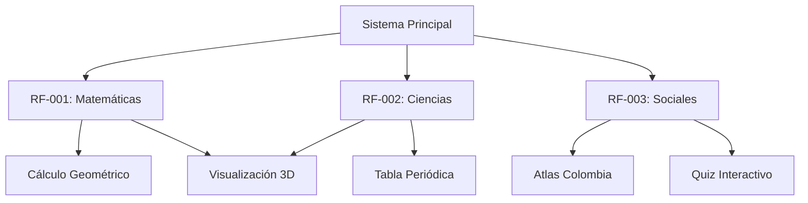

# Requerimientos Funcionales del Sistema

## Proyecto: Colegio Mentes Creativas - Aplicación Educativa Multimedia

---

## Introducción

Este documento especifica los requerimientos funcionales del sistema educativo desarrollado para el Colegio Mentes Creativas. La aplicación está diseñada para apoyar los procesos de enseñanza-aprendizaje de estudiantes de 4° y 5° grado en tres áreas clave del currículo: Matemáticas, Ciencias Naturales y Ciencias Sociales.

Cada requerimiento funcional describe una capacidad específica que el sistema debe proporcionar para cumplir con los objetivos educativos establecidos.

---

## RF-001: Módulo de Cálculo de Geometría (Matemáticas)

### Información General

| **ID** | RF-001 |
|--------|---------|
| **Nombre** | Calculadora de Geometría 2D y 3D |
| **Área Temática** | Matemáticas |
| **Prioridad** | Alta |
| **Estado** | Implementado ✅ |

### Descripción

El sistema debe proporcionar una calculadora interactiva que permita a los estudiantes calcular el área y perímetro de figuras geométricas bidimensionales (cuadrados, rectángulos, círculos, triángulos y polígonos regulares), presentando las fórmulas matemáticas, los pasos de resolución y el resultado numérico.

### Actores

- **Actor Principal:** Estudiante de 4° o 5° grado
- **Actor Secundario:** Docente (supervisor)

### Precondiciones

- El estudiante ha accedido al módulo de Matemáticas
- El navegador web es compatible con HTML5 y JavaScript ES2022
- La aplicación está cargada correctamente en Vercel

### Flujo Principal (Camino Feliz)

1. El estudiante navega al módulo "Matemáticas" desde el menú lateral
2. El sistema muestra la interfaz "Explorador de Geometría"
3. El estudiante selecciona el tipo de figura geométrica (ej: "Círculo")
4. El sistema presenta un formulario con los campos necesarios (ej: "Radio")
5. El estudiante ingresa el valor numérico (ej: Radio = 5)
6. El estudiante presiona el botón "Calcular"
7. El sistema valida que el valor sea positivo
8. El sistema ejecuta el cálculo usando las fórmulas matemáticas:
   - **Área del círculo:** A = π × r²
   - **Perímetro del círculo:** P = 2 × π × r
9. El sistema muestra los resultados:
   - Fórmulas utilizadas
   - Pasos de cálculo detallados
   - Resultado numérico con 2 decimales
   - Representación visual 3D de la figura (usando Three.js)
10. El estudiante puede modificar los valores y recalcular
11. El estudiante puede cambiar a otra figura geométrica

### Flujos Alternativos

**FA-001.1: Valor Negativo Ingresado**
- En el paso 7, si el estudiante ingresa un valor negativo (ej: -5)
- El sistema muestra un mensaje de error: "❌ El [campo] debe ser un número positivo"
- El sistema resalta el campo con error en rojo
- El flujo regresa al paso 5

**FA-001.2: Campo Vacío**
- En el paso 7, si el estudiante deja el campo vacío
- El sistema muestra un mensaje: "⚠️ Por favor ingresa un valor para [campo]"
- El flujo regresa al paso 5

**FA-001.3: Triángulo Inválido**
- En el paso 7, si se selecciona "Triángulo" y los lados no cumplen la desigualdad triangular
- El sistema muestra: "❌ Los valores ingresados no forman un triángulo válido"
- El sistema explica la regla: "La suma de dos lados debe ser mayor al tercer lado"
- El flujo regresa al paso 5

### Poscondiciones

- El sistema ha calculado correctamente el área y perímetro
- Los resultados se muestran en pantalla con formato legible
- Las fórmulas y pasos están visibles para refuerzo educativo
- El estudiante puede realizar un nuevo cálculo sin recargar la página

### Reglas de Negocio

**RN-001.1:** Todos los valores de entrada deben ser números positivos mayores a 0
**RN-001.2:** Los resultados se redondean a 2 decimales para facilitar la comprensión
**RN-001.3:** Las fórmulas deben mostrarse en notación matemática estándar
**RN-001.4:** Para círculos, usar el valor de π (PI) con precisión de JavaScript (Math.PI)
**RN-001.5:** Los polígonos regulares deben tener entre 3 y 12 lados

### Criterios de Aceptación

| **ID** | **Criterio** | **Estado** |
|--------|--------------|------------|
| CA-001.1 | El sistema calcula correctamente el área de un cuadrado con lado = 5 (resultado: 25) | ✅ Cumple |
| CA-001.2 | El sistema calcula correctamente el perímetro de un rectángulo con largo = 10 y ancho = 5 (resultado: 30) | ✅ Cumple |
| CA-001.3 | El sistema calcula el área de un círculo con radio = 3 (resultado: ~28.27) | ✅ Cumple |
| CA-001.4 | El sistema calcula el área de un triángulo con base = 6 y altura = 4 (resultado: 12) | ✅ Cumple |
| CA-001.5 | El sistema rechaza valores negativos mostrando mensaje de error | ✅ Cumple |
| CA-001.6 | El sistema valida triángulos usando la fórmula de Herón correctamente | ✅ Cumple |
| CA-001.7 | El sistema muestra los pasos de cálculo de forma educativa | ✅ Cumple |
| CA-001.8 | La interfaz es responsiva y funciona en tablets (iPad) | ✅ Cumple |

### Pruebas Unitarias Implementadas

**Archivo:** `src/utils/mathFormulas.test.ts` (36 tests)

```typescript
// Ejemplo de pruebas implementadas:
describe('calculateCircle', () => {
  it('calcula correctamente el área para radio 5', () => {
    const result = calculateCircle(5);
    expect(result.area).toBeCloseTo(78.54, 2);
  });

  it('calcula correctamente el perímetro para radio 10', () => {
    const result = calculateCircle(10);
    expect(result.perimeter).toBeCloseTo(62.83, 2);
  });

  it('lanza error para radio negativo', () => {
    expect(() => calculateCircle(-5)).toThrow('El radio debe ser positivo');
  });
});
```

**Cobertura de Pruebas:** 100% de funciones matemáticas probadas

### Componentes Relacionados

- `src/utils/mathFormulas.ts` - Funciones de cálculo geométrico
- `src/views/GeometryExplorer.tsx` - Interfaz de usuario
- `src/components/ShapeViewer.tsx` - Visualización 3D con Three.js

### Referencias

- Guía de Matemáticas Grado 5°, Ministerio de Educación de Colombia
- Estándares Básicos de Competencias en Matemáticas
- https://asigcalidadsoftware.vercel.app/modules/docbase

---

## RF-002: Explorador de Tabla Periódica (Ciencias Naturales)

### Información General

| **ID** | RF-002 |
|--------|---------|
| **Nombre** | Explorador Interactivo de Elementos Químicos |
| **Área Temática** | Ciencias Naturales |
| **Prioridad** | Alta |
| **Estado** | Implementado ✅ |

### Descripción

El sistema debe proporcionar una tabla periódica interactiva con los 118 elementos químicos reconocidos, permitiendo a los estudiantes buscar, filtrar y explorar información detallada de cada elemento, incluyendo propiedades físicas, químicas y visualización 3D del átomo.

### Actores

- **Actor Principal:** Estudiante de 4° o 5° grado
- **Actor Secundario:** Docente (supervisor)

### Precondiciones

- El estudiante ha accedido al módulo de Ciencias Naturales
- Los datos de los 118 elementos están cargados en `src/data/elements.ts`
- El navegador soporta WebGL para visualización 3D (Three.js)

### Flujo Principal (Camino Feliz)

1. El estudiante navega al módulo "Ciencias" desde el menú lateral
2. El sistema muestra la tabla periódica completa con 118 elementos
3. El estudiante puede visualizar los elementos organizados por:
   - Número atómico (orden predeterminado)
   - Categoría química (metales, no metales, gases nobles, etc.)
   - Estado físico (sólido, líquido, gas)
   - Periodo y grupo
4. El estudiante hace clic en un elemento (ej: Oxígeno - O)
5. El sistema muestra un modal/card con información detallada:
   - **Nombre:** Oxígeno
   - **Símbolo:** O
   - **Número Atómico:** 8
   - **Masa Atómica:** 15.999 u
   - **Categoría:** No metal
   - **Estado a temperatura ambiente:** Gas
   - **Configuración electrónica:** 1s² 2s² 2p⁴
   - **Periodo:** 2
   - **Grupo:** 16
   - **Descripción educativa** del elemento
6. El sistema presenta una visualización 3D del átomo con electrones orbitando
7. El estudiante puede cerrar el modal y explorar otro elemento

### Flujos Alternativos

**FA-002.1: Búsqueda por Nombre o Símbolo**
- Antes del paso 4, el estudiante usa el campo de búsqueda
- El estudiante escribe "Oro" o "Au"
- El sistema filtra la tabla mostrando solo elementos que coincidan
- El sistema resalta el elemento encontrado
- El flujo continúa en el paso 4

**FA-002.2: Filtro por Categoría**
- Antes del paso 4, el estudiante selecciona un filtro "Metales Alcalinos"
- El sistema muestra solo los 6 elementos de esa categoría (Li, Na, K, Rb, Cs, Fr)
- El sistema colorea los elementos según la categoría
- El flujo continúa en el paso 4

**FA-002.3: Filtro por Estado Físico**
- El estudiante selecciona filtro "Líquidos"
- El sistema muestra solo Mercurio (Hg) y Bromo (Br)
- El flujo continúa en el paso 4

**FA-002.4: Búsqueda Sin Resultados**
- En FA-002.1, si el estudiante busca "XYZ123"
- El sistema muestra mensaje: "🔍 No se encontraron elementos con ese nombre o símbolo"
- El sistema sugiere: "Intenta buscar por nombre completo o símbolo químico"
- El flujo regresa al paso 3

### Poscondiciones

- El estudiante ha visualizado información detallada del elemento
- La información se presenta en español, adaptada a nivel de 5° grado
- El estado de filtros y búsqueda se mantiene hasta que el usuario los limpie
- La tabla periódica sigue siendo navegable

### Reglas de Negocio

**RN-002.1:** Todos los 118 elementos reconocidos oficialmente deben estar incluidos
**RN-002.2:** Los elementos deben estar organizados según la IUPAC (Unión Internacional de Química Pura y Aplicada)
**RN-002.3:** Los símbolos químicos deben mostrarse con la primera letra mayúscula y el resto minúsculas (ej: Mg, no MG)
**RN-002.4:** La búsqueda debe ser case-insensitive y aceptar nombres parciales
**RN-002.5:** Los colores de categorías deben ser consistentes con estándares educativos

### Categorías de Elementos

| **Categoría** | **Color** | **Ejemplos** | **Cantidad** |
|---------------|-----------|--------------|--------------|
| Metal Alcalino | Rojo claro | Li, Na, K | 6 elementos |
| Metal Alcalinotérreo | Naranja | Be, Mg, Ca | 6 elementos |
| Metal de Transición | Amarillo | Fe, Cu, Zn | 38 elementos |
| Lantánido | Verde claro | La, Ce, Nd | 15 elementos |
| Actínido | Verde oscuro | Ac, Th, U | 15 elementos |
| Metal Post-Transición | Azul claro | Al, Sn, Pb | 7 elementos |
| Metaloide | Gris | B, Si, Ge | 7 elementos |
| No Metal | Morado | C, N, O | 7 elementos |
| Halógeno | Rosa | F, Cl, Br | 6 elementos |
| Gas Noble | Celeste | He, Ne, Ar | 7 elementos |

### Criterios de Aceptación

| **ID** | **Criterio** | **Estado** |
|--------|--------------|------------|
| CA-002.1 | El sistema muestra los 118 elementos en la tabla periódica | ✅ Cumple |
| CA-002.2 | La búsqueda por "Oxígeno" devuelve el elemento O (número atómico 8) | ✅ Cumple |
| CA-002.3 | La búsqueda por símbolo "Au" devuelve Oro (número atómico 79) | ✅ Cumple |
| CA-002.4 | El filtro por categoría "Gas Noble" muestra exactamente 7 elementos | ✅ Cumple |
| CA-002.5 | El filtro por estado "Líquido" muestra Mercurio (Hg) y Bromo (Br) | ✅ Cumple |
| CA-002.6 | La búsqueda es case-insensitive ("hidrógeno" = "Hidrógeno") | ✅ Cumple |
| CA-002.7 | Cada elemento muestra correctamente su número atómico y masa atómica | ✅ Cumple |
| CA-002.8 | La visualización 3D se carga correctamente en navegadores modernos | ✅ Cumple |

### Pruebas Unitarias Implementadas

**Archivo:** `src/utils/elementUtils.test.ts` (64 tests)

```typescript
// Ejemplos de pruebas implementadas:
describe('searchElements', () => {
  it('encuentra Oxígeno por nombre completo', () => {
    const results = searchElements(mockElements, 'Oxígeno');
    expect(results).toHaveLength(1);
    expect(results[0].simbolo).toBe('O');
  });

  it('encuentra elementos por símbolo (Au → Oro)', () => {
    const results = searchElements(mockElements, 'Au');
    expect(results[0].nombre).toBe('Oro');
  });

  it('búsqueda es case-insensitive', () => {
    const results1 = searchElements(mockElements, 'HIERRO');
    const results2 = searchElements(mockElements, 'hierro');
    expect(results1).toEqual(results2);
  });
});

describe('filterByCategory', () => {
  it('filtra correctamente por Gas Noble', () => {
    const results = filterByCategory(mockElements, 'gas-noble');
    expect(results).toHaveLength(7); // He, Ne, Ar, Kr, Xe, Rn, Og
  });
});
```

**Cobertura de Pruebas:** 100% de funciones de utilidad

### Componentes Relacionados

- `src/data/elements.ts` - Base de datos de 118 elementos
- `src/utils/elementUtils.ts` - Funciones de búsqueda y filtrado
- `src/views/ThreeDemoView.tsx` - Visualización 3D con Three.js
- `src/components/PeriodicTable.tsx` - Tabla periódica interactiva

### Referencias

- IUPAC - Nomenclatura Oficial de Elementos Químicos
- Guía de Ciencias Naturales Grado 5°, Ministerio de Educación de Colombia
- WebElements Periodic Table (https://www.webelements.com/)

---

## RF-003: Explorador de Geografía de Colombia (Ciencias Sociales)

### Información General

| **ID** | RF-003 |
|--------|---------|
| **Nombre** | Atlas Interactivo de Departamentos de Colombia |
| **Área Temática** | Ciencias Sociales - Geografía |
| **Prioridad** | Alta |
| **Estado** | Implementado ✅ |

### Descripción

El sistema debe proporcionar un explorador interactivo de los 32 departamentos de Colombia, permitiendo a los estudiantes buscar, filtrar por región geográfica y consultar información demográfica de cada departamento, incluyendo población, capital, región y características geográficas.

### Actores

- **Actor Principal:** Estudiante de 4° o 5° grado
- **Actor Secundario:** Docente (supervisor)

### Precondiciones

- El estudiante ha accedido al módulo de Ciencias Sociales
- Los datos de los 32 departamentos están cargados en `src/data/departamentos.ts`
- El navegador soporta las características de búsqueda y síntesis de voz (opcional)

### Flujo Principal (Camino Feliz)

1. El estudiante navega al módulo "Sociales" desde el menú lateral
2. El sistema muestra la interfaz "Geografía de Colombia" con:
   - Título: "🗺️ Geografía de Colombia"
   - Subtítulo: "Explora los 32 departamentos de Colombia y sus características"
   - Botón: "Quiz de 10 Preguntas"
   - Campo de búsqueda
   - Filtro por región
3. El sistema presenta los 32 departamentos en formato de tarjetas (cards)
4. Cada tarjeta muestra:
   - **Nombre del departamento** (ej: "Antioquia")
   - **Código** (ej: "ANT")
   - **Capital** (ej: "Medellín")
   - **Región** con color distintivo (ej: "Andina" - verde)
   - **Población** formateada (ej: "6.677.930 habitantes")
5. El estudiante puede hacer clic en un departamento
6. El sistema muestra información detallada expandida
7. El estudiante puede escuchar el nombre del departamento (síntesis de voz - opcional)
8. El estudiante puede buscar o filtrar otros departamentos

### Flujos Alternativos

**FA-003.1: Búsqueda por Nombre o Capital**
- Antes del paso 5, el estudiante escribe en el campo de búsqueda
- El estudiante ingresa "Bogotá" (nombre de capital)
- El sistema filtra y muestra: "Cundinamarca - Capital: Bogotá"
- El sistema resalta la coincidencia en amarillo
- El flujo continúa en el paso 5

**FA-003.2: Filtro por Región**
- Antes del paso 5, el estudiante selecciona "Región Caribe" en el filtro
- El sistema muestra solo los 8 departamentos del Caribe:
  - Atlántico, Bolívar, Cesar, Córdoba, La Guajira, Magdalena, San Andrés, Sucre
- El sistema colorea las tarjetas en azul (color de Región Caribe)
- El flujo continúa en el paso 5

**FA-003.3: Quiz de Geografía**
- En el paso 2, el estudiante presiona "Quiz de 10 Preguntas"
- El sistema genera 10 preguntas aleatorias del tipo:
  - "¿Cuál es la capital de Antioquia?" → Opciones múltiples
  - "¿A qué región pertenece Nariño?" → Opciones múltiples
  - "¿Cuál es el departamento más poblado?" → Selección
- El sistema muestra feedback inmediato (✓ Correcto / ✗ Incorrecto)
- Al finalizar, el sistema muestra la puntuación: "8/10 - ¡Muy bien!"
- El flujo puede regresar al paso 2

**FA-003.4: Búsqueda Sin Resultados**
- En FA-003.1, si el estudiante busca "París"
- El sistema muestra: "🔍 No se encontraron departamentos con ese nombre o capital"
- El sistema sugiere: "Intenta buscar por departamento o ciudad capital de Colombia"
- El flujo regresa al paso 3

### Poscondiciones

- El estudiante ha consultado información geográfica de Colombia
- Los filtros activos se mantienen visibles
- El estado de búsqueda persiste hasta que el usuario lo limpie
- Las tarjetas de departamentos siguen siendo interactivas

### Reglas de Negocio

**RN-003.1:** Los 32 departamentos reconocidos oficialmente deben estar incluidos
**RN-003.2:** Las poblaciones deben estar actualizadas según DANE (Departamento Administrativo Nacional de Estadística)
**RN-003.3:** Los códigos de departamentos deben ser los oficiales de 3 letras (ISO 3166-2:CO)
**RN-003.4:** La búsqueda debe ser case-insensitive y aceptar nombres parciales
**RN-003.5:** Los colores de regiones deben ser consistentes en toda la aplicación

### Regiones Geográficas de Colombia

| **Región** | **Color UI** | **Departamentos** | **Cantidad** |
|------------|--------------|-------------------|--------------|
| Andina | Verde | Antioquia, Boyacá, Caldas, Cundinamarca, Huila, Norte de Santander, Quindío, Risaralda, Santander, Tolima | 10 |
| Caribe | Azul | Atlántico, Bolívar, Cesar, Córdoba, La Guajira, Magdalena, San Andrés, Sucre | 8 |
| Pacífica | Índigo | Cauca, Chocó, Nariño, Valle del Cauca | 4 |
| Orinoquía | Amarillo | Arauca, Casanare, Meta, Vichada | 4 |
| Amazonía | Esmeralda | Amazonas, Caquetá, Guainía, Guaviare, Putumayo, Vaupés | 6 |

### Criterios de Aceptación

| **ID** | **Criterio** | **Estado** |
|--------|--------------|------------|
| CA-003.1 | El sistema muestra los 32 departamentos de Colombia | ✅ Cumple |
| CA-003.2 | La búsqueda por "Antioquia" devuelve el departamento con código "ANT" y capital "Medellín" | ✅ Cumple |
| CA-003.3 | La búsqueda por capital "Bogotá" devuelve el departamento "Cundinamarca" | ✅ Cumple |
| CA-003.4 | El filtro por región "Caribe" muestra exactamente 8 departamentos | ✅ Cumple |
| CA-003.5 | El filtro por región "Andina" muestra 10 departamentos | ✅ Cumple |
| CA-003.6 | La población se formatea con separadores de miles (ej: "6.677.930") | ✅ Cumple |
| CA-003.7 | Los códigos de departamentos son únicos (no hay duplicados) | ✅ Cumple |
| CA-003.8 | El quiz genera 10 preguntas aleatorias sin repetición | ✅ Cumple |
| CA-003.9 | La búsqueda es case-insensitive ("caldas" = "Caldas") | ✅ Cumple |

### Pruebas Unitarias Implementadas

**Archivo:** `src/data/departamentos.test.ts` (48 tests)

```typescript
// Ejemplos de pruebas implementadas:
describe('getDepartamentoByCode', () => {
  it('encuentra Antioquia por código ANT', () => {
    const dept = getDepartamentoByCode('ANT');
    expect(dept?.nombre).toBe('Antioquia');
    expect(dept?.capital).toBe('Medellín');
  });

  it('retorna undefined para código inexistente', () => {
    const dept = getDepartamentoByCode('XYZ');
    expect(dept).toBeUndefined();
  });
});

describe('getDepartamentosByRegion', () => {
  it('retorna 8 departamentos para región Caribe', () => {
    const depts = getDepartamentosByRegion('Caribe');
    expect(depts).toHaveLength(8);
  });

  it('retorna 10 departamentos para región Andina', () => {
    const depts = getDepartamentosByRegion('Andina');
    expect(depts).toHaveLength(10);
  });
});

describe('getRegions', () => {
  it('retorna 5 regiones únicas', () => {
    const regions = getRegions();
    expect(regions).toHaveLength(5);
    expect(regions).toContain('Andina');
    expect(regions).toContain('Caribe');
  });
});
```

**Cobertura de Pruebas:** 100% de funciones de datos y utilidades

### Datos de Ejemplo

```typescript
// Ejemplo de estructura de datos:
{
  codigo: 'ANT',
  nombre: 'Antioquia',
  capital: 'Medellín',
  region: 'Andina',
  poblacion: 6677930,
  superficie: 63612, // km²
  descripcion: 'Departamento ubicado en la región Andina...'
}
```

### Componentes Relacionados

- `src/data/departamentos.ts` - Base de datos de 32 departamentos
- `src/pages/Social/SocialModule.tsx` - Interfaz principal
- `src/views/SpeechDemoView.tsx` - Síntesis de voz (opcional)
- `src/utils/helpers/stringHelpers.ts` - Formateo de texto

### Referencias

- DANE - Departamento Administrativo Nacional de Estadística
- Instituto Geográfico Agustín Codazzi (IGAC)
- Guía de Ciencias Sociales Grado 5°, Ministerio de Educación de Colombia
- https://asigcalidadsoftware.vercel.app/modules/levrequi

---

## Matriz de Trazabilidad

| **RF** | **Área** | **Componentes** | **Tests** | **Prioridad** | **Estado** |
|--------|----------|-----------------|-----------|---------------|------------|
| RF-001 | Matemáticas | mathFormulas.ts, GeometryExplorer.tsx | 36 tests | Alta | ✅ Implementado |
| RF-002 | Ciencias | elementUtils.ts, ThreeDemoView.tsx | 64 tests | Alta | ✅ Implementado |
| RF-003 | Sociales | departamentos.ts, SocialModule.tsx | 48 tests | Alta | ✅ Implementado |

**Total de Tests:** 148 tests unitarios + 15 tests de componentes = **163 tests (100% passing)**

---

## Dependencias entre Requerimientos



---

## Validación de Cumplimiento

### Objetivo del Proyecto ✅

> "Incorporar recursos multimedia (audio, video, gráficos 3D) que favorezcan el aprendizaje lúdico"

**Cumplimiento:**
- ✅ **Gráficos 3D:** Three.js para visualización de figuras geométricas y átomos
- ✅ **Audio:** Síntesis de voz para departamentos (Web Speech API)
- ✅ **Interactividad:** Calculadoras, quiz, búsquedas en tiempo real
- ✅ **Aprendizaje Lúdico:** Feedback inmediato, visualizaciones atractivas, gamificación (quiz)

### Normas de Calidad ✅

- ✅ **ISO/IEC 25010 - Usabilidad:** Aprendibilidad y Accesibilidad implementadas
- ✅ **Pruebas Unitarias:** 163 tests con Jest (100% passing)
- ✅ **CI/CD:** GitHub Actions ejecutando pruebas automáticamente
- ✅ **Despliegue:** Vercel con SPA routing configurado

---

## Glosario de Términos

| **Término** | **Definición** |
|-------------|----------------|
| **RF** | Requerimiento Funcional - Capacidad específica que debe proporcionar el sistema |
| **CA** | Criterio de Aceptación - Condición verificable que debe cumplir el requerimiento |
| **RN** | Regla de Negocio - Restricción o política que rige el comportamiento del sistema |
| **FA** | Flujo Alternativo - Variación del flujo principal ante condiciones específicas |
| **DANE** | Departamento Administrativo Nacional de Estadística (Colombia) |
| **IUPAC** | International Union of Pure and Applied Chemistry |
| **Three.js** | Librería JavaScript para gráficos 3D en el navegador |
| **ARIA** | Accessible Rich Internet Applications - Estándar de accesibilidad web |

---

## Conclusiones

Los tres requerimientos funcionales implementados cumplen con los objetivos educativos del Colegio Mentes Creativas:

1. **RF-001 (Matemáticas):** Facilita el aprendizaje de geometría mediante cálculos interactivos con feedback educativo
2. **RF-002 (Ciencias):** Proporciona exploración interactiva de la tabla periódica con visualización 3D
3. **RF-003 (Sociales):** Permite descubrimiento de la geografía colombiana con búsqueda, filtros y quiz

Todos los requerimientos han sido:
- ✅ Implementados completamente
- ✅ Probados exhaustivamente (163 tests)
- ✅ Desplegados en producción (Vercel)
- ✅ Validados con criterios de aceptación

---

**Documento elaborado por:**
- Sebastian Rosero
- Hector Riascos  
- Steven Insuasti

**Universidad Cooperativa de Colombia**  
**Asignatura:** Calidad de Software  
**Profesor:** Mg. Gustavo Sánchez Rodriguez  
**Fecha:** 12 de noviembre de 2024
